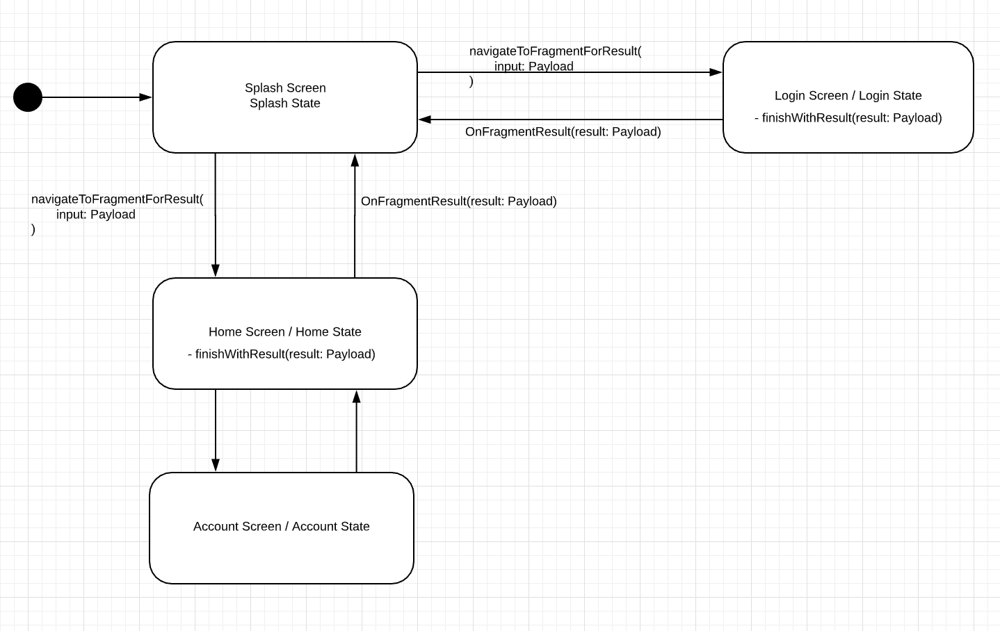

# Pack-Navigation

Android JetPack Navigation is great! 
However, there are some points that still need us the developers to tweak, in order to have a pleasant App navigation.

  - Fragment Parent-Child relationship
  - Data passing between Fragments without the need for Serialization
  - Back Navigation still tricky
  - Some solutions to data sharing invlove sharing a common ViewModel with the Activity Scope. This may work but creates problem if two instances of the same Fragment type are launched by the navController,
  "They will share the same instance of the ViewModel".

### Pack Navigation

This library solves above mentioned issues. It only consist of a couple of classes so is really small.



### How to use

First thing probably the most invasive is to inherit from NavBaseFragment. I Haven't had the time to make a version based on composition yet.

```kotlin
class FragmentA : NavBaseFragment<ViewModelA>() {
```

Launching a Fragment:
```kotlin
navigateToFragmentForResult(
                R.id.fragmentA,
                FragmentA.Input(anyPayload)
            )
```

Above code will navigate to a new instance of FragmentA and a new ViewModel class instance as well. Make sure the fragmentA is defined in the nav_graph.xml.
When inheriting from NavBaseFragment you will have to fill 3 Callbacks methods in which the corresponding Payload data will be passed in.

```kotlin
// FragmentA.kt

    override fun createViewModel(): ViewModelA {
        return ViewModelA()
    }

    override fun onFragmentStartWithInput(
        viewModel: ViewModelA,
        inputMessage: NavigationMessage.Input
    ) {
        this.viewModelA = viewModel
        this.input = inputMessage.payload as? FragmentA.Input
        ...
    }
    
    override fun onFragmentResult(
        viewModel: ViewModelA,
        inputMessage: NavigationMessage.Input,
        resultMessage: NavigationMessage.Result
    ) {
        this.viewModelA = viewModel
        this.input = inputMessage.payload as? Input
        ...
    }
    
```

`override fun createViewModel(): ViewModelA` Here you will return a new instance of the ViewModel class corresponding to this Fragment.

`override fun onFragmentStartWithInput()` This method is called when your Fragment enters the stage from another Caller Fragment, lets say from a Parent Fragment.

`override fun onFragmentResult` This method is called when your Fragment enters the stage from a Child Fragment that called `finishWithResult(resultPayload)`.

Back pressed event can be handled in either of the following overide methods.

```kotlin
    override fun onBackStackEmpty(): Boolean {
        activity?.finish()
        return true
    }
```

or

```kotlin
protected open fun handleBackNavigation(): Boolean
```

They both allow to intercept the default behavior of popping the current screen returning a Canceled result back to the Caller Fragment.

##### Check more in the sample app!
